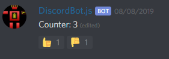

# discord-dynamic-messages

__What exactly is the usage of this lib?__

Basically it helps with creating messages that dynamically change their contents based on how ppl react on it. Aka, the message content acts as a screen, and the reactions act as input buttons.

```ts
import { Client } from 'discord.js';
import { DynamicMessage, OnReaction } from 'discord-dynamic-messages';

export class CounterMessage extends DynamicMessage {
  private counter;
  constructor(args) {
    super();
    this.counter = args.initialCounterValue;
  }

  @OnReaction(':thumbsup:')
  public increment(user, channel, reaction) {
    this.counter += 1;
  }

  @OnReaction(':thumbsdown:')
  public decrement(user, channel, reaction) {
    this.counter -= 1;
  }

  public render() {
    return `Counter: ${this.counter}`;
  }
}

const client = new Client();
client.on('ready', () => {
  client.on('message', (message) => {
    new CounterMessage({
      initialCounterValue: 0,
    }).sendTo(message.channel);
  });
});
client.login(discord_secret);
```



## Install

__Note:__ This library depends on typescript decorators, and will therefore not work properly unless used in a correctly configured typescript project.

1. Install library: [`npm i discord-dynamic-messages`](https://www.npmjs.com/package/discord-dynamic-messages).
2. Enable `experimentalDecorators` and `emitDecoratorMetadata` in `tsconfig.json`.
3. Try the example above.

_Note: If you are using vscode you might need to set `javascript.implicitProjectConfig.experimentalDecorators` to `true` in the workspace settings._

## Documentation

### DynamicMessage

```ts
abstract class DynamicMessage {
  constructor(config: IDynamicMessageConfig);
  abstract public render(): string | RichEmbed;
}
interface IDynamicMessageConfig {
  volatile: boolean;
  onError?: (error: Error) => void;
}
```

This is the base class of the library, every dynamic message must extend this class.<br>
Every class that extends this DynamicMessage must implement a render method.<br>
The volatile config option determines wether or not errors should be thrown, or passed to the error handler.<br>
The render method is used to determine the contents of the corresponding "discord text message".

#### DynamicMessage#reRender

```ts
type reRender = () => void
```

Used to manually trigger a rerender.

```ts
class Foo extends DynamicMessage {
  public doStuff() {
    // do some stuff
    this.reRender()
  }
  
  public render() {
    return 'stuff';
  }
}
```

#### DynamicMessage#addReactions

```ts
type addReactions = (emoji: string[]) => void
```

Used to manually add reactions to a message.

```ts
class Foo extends DynamicMessage {
  public addOneTwoThree() {
    this.addReactions([
      ':one:', ':two:', ':three:',
    ]);
  }
  
  public render() {
    return 'stuff';
  }
}
```

#### DynamicMessage#sendTo

```ts
type sendTo = (channel: Discord.Channel) => DynamicMessage
```

Sends the dynamic message to the given channel.

```ts
class Foo extends DynamicMessage {
  public render() {
    return 'stuff';
  }
}

client.on('message', (msg) => {
  new Foo().sendTo(msg.channel)
})
```

#### DynamicMessage#replyTo

```ts
type replyTo = (message: Discord.Message) => DynamicMessage
```

Sends the dynamic message as a reply to the given message.

```ts
class Foo extends DynamicMessage {
  public render() {
    return 'stuff';
  }
}

client.on('message', (msg) => {
  new Foo().replyTo(msg)
})
```

#### DynamicMessage#attachTo

```ts
type attachTo = (message: Discord.Message, responseTo?: Discord.User) => DynamicMessage
```

Attaches an existing message to the DynamicMessage instance, then call render on the instance and overwrite the content of the existing message.  

```ts
class Foo extends DynamicMessage {
  public render() {
    return 'stuff';
  }
}

client.on('message', (msg) => {
  const reply = msg.reply('tmp');

  // Attach in the same way as DynamicMessage#sendTo
  new Foo().attachTo(reply);

  // Attach in the same way as DynamicMessage#replyTo
  new Foo().attachTo(reply, msg.author);
})
```

### OnInit

```ts
type OnInit = Decorator<() => void>
```

OnInit is a decorator that tells the dynamic message what functions to call when a discord text message is attached to the dynamic message. Note that if the dynamic message is reused (aka attached to another discord text message after the first one) the init function will fire again.

```ts
class Foo extends DynamicMessage {

  @OnInit
  public initialize() {
    console.log(this.message.content);
    // => stuff
  }

  public render() {
    return 'stuff';
  }
}
```

### OnReaction

```ts
type OnReaction = (emoji: string, config?:IReactionConfig) => Decorator<(user: Discord.User, channel: Discord.Channel, reaction: Discord.Reaction) => void>
```

OnReaction is a decorator that tells the dynamic message what functions to call in response to what emoji when a reaction is made on the corresponding "discord text message".

```ts
interface IReactionConfig {

  // (default: false) when false the bot will react with the given emoji to show the users what emoji the message is prepared to react to.
  hidden?: boolean;
  
  // (default: true) when true the bot will call the render method of the dynamic message after the reaction callback have executed.
  triggerRender?: boolean;
  
  // (default: true) when true the bot will remove user reactions after the callback have executed.
  removeWhenDone?: boolean;
  
  // (default: true) should reactions from bots trigger this callback?
  ignoreBots?: boolean;
  
  // (default: false) should reactions from humans trigger this callback?
  ignoreHumans?: boolean;

  // (default: true) should reactions made while the bot was offline / not setup trigger this callback
  doRetroactiveCallback?: boolean;
 }
```

```ts
class Foo extends DynamicMessage {

  @OnReaction(':thumbsup:')
  public react(user, channel, reaction) {
    console.log('WOW!');
  }

  public render() {
    return 'stuff';
  }
}
```

### OnReactionRemoved

```ts
type OnReactionRemoved = (emoji: string, config?:IReactionConfig) => Decorator<(user: Discord.User, channel: Discord.Channel, reaction: Discord.Reaction) => void>
```

OnReactionRemoved is a decorator that tells the dynamic message what functions to call in response to what emoji when a reaction removed from the corresponding "discord text message".

```ts
interface IReactionConfig {
  
  // (default: true) when true the bot will call the render method of the dynamic message after the reaction callback have executed.
  triggerRender?: boolean;
  
  // (default: true) should reactions from bots trigger this callback?
  ignoreBots?: boolean;
  
  // (default: false) should reactions from humans trigger this callback?
  ignoreHumans?: boolean;
 }
```

```ts
class Foo extends DynamicMessage {
  private toggle: boolean = false;

  @OnReaction(":thumbsup:", {
    removeWhenDone: false,
  })
  public on() {
    this.toggle = true;
  }

  @OnReactionRemoved(":thumbsup:")
  public off() {
    this.toggle = false;
  }

  public render() {
    return '```diff\n' + (this.toggle ? '+ on' : '- off') + '\n```';
  }
}
```

### OnAnyReaction

```ts
type OnAnyReaction = (config?:ICatchAllConfig) => Decorator<(user: Discord.User, channel: Discord.Channel, reaction: Discord.Reaction) => void>
```

OnAnyReaction is a decorator that tells the dynamic message what functions to call when any reaction is made on the corresponding "discord text message".

```ts
interface ICatchAllConfig {

  // (default: true) when true the bot will call the render method of the dynamic message after the reaction callback have executed.
  triggerRender?: boolean;
  
  // (default: true) should reactions from bots trigger this callback?
  ignoreBots?: boolean;
  
  // (default: false) should reactions from humans trigger this callback?
  ignoreHumans?: boolean;
 }
```

```ts
export class Foo extends DynamicMessage {
  private accumulator: string = '';

  @OnAnyReaction()
  public accumulate(user, channel, reaction) {
    this.accumulator += reaction.emoji.name;
  }

  public render() {
    return `Accumulator: ${this.addAccumulator}`;
  }
}
```

### OnAnyReactionRemoved

```ts
type OnAnyReactionRemoved = (config?:ICatchAllConfig) => Decorator<(user: Discord.User, channel: Discord.Channel, reaction: Discord.Reaction) => void>
```

OnAnyReaction is a decorator that tells the dynamic message what functions to call when any reaction is removed from the corresponding "discord text message".

```ts
interface ICatchAllConfig {

  // (default: true) when true the bot will call the render method of the dynamic message after the reaction callback have executed.
  triggerRender?: boolean;
  
  // (default: true) should reactions from bots trigger this callback?
  ignoreBots?: boolean;
  
  // (default: false) should reactions from humans trigger this callback?
  ignoreHumans?: boolean;
 }
```

```ts
export class Foo extends DynamicMessage {
  private accumulator: string = '';

  @OnAnyReactionRemoved()
  public accumulate(user, channel, reaction) {
    this.accumulator += reaction.emoji.name;
  }

  public render() {
    return `Accumulator: ${this.addAccumulator}`;
  }
}
```

## Demos

_See the [/demo](./demo/) folder_

## Development

1. Grab your discord-bot secret from the [discord developer portal](https://discordapp.com/developers/applications).
2. Create a `secrets.json` file and store your discord-bot secret as `discord_token` inside it.
3. Install dependencies: `npm i`.
4. Start demo: `npm run demo:start`.
